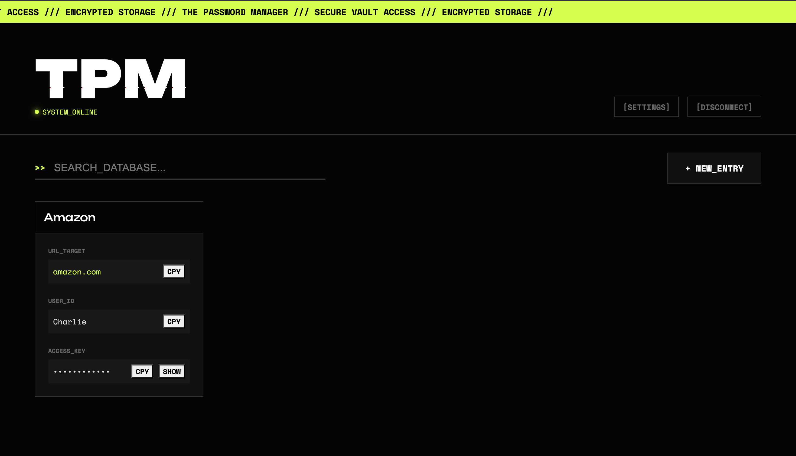

# TPM | The Password Manager

A cyberpunk password vault built with SvelteKit and a Rust webserver backend.

## Features

- Secure password storage
- Encrypted database
- Glitchy, Cyberpunk aesthetic



## Usage

1. Clone the repository

```bash
git clone https://github.com/charliekerfoot/tpm.git
```

2. Install dependencies

```bash
npm install
```

3. Run the server

```bash
cd backend
cargo run
```

4. Run the client

```bash
cd ../frontend
npm run dev
```

5. Open http://localhost:5173 in your browser
